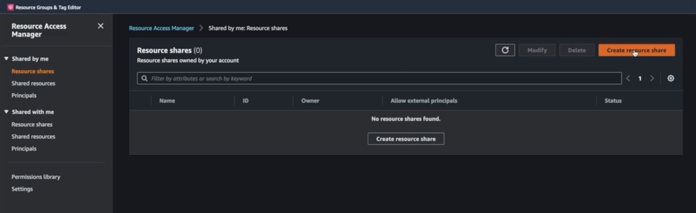
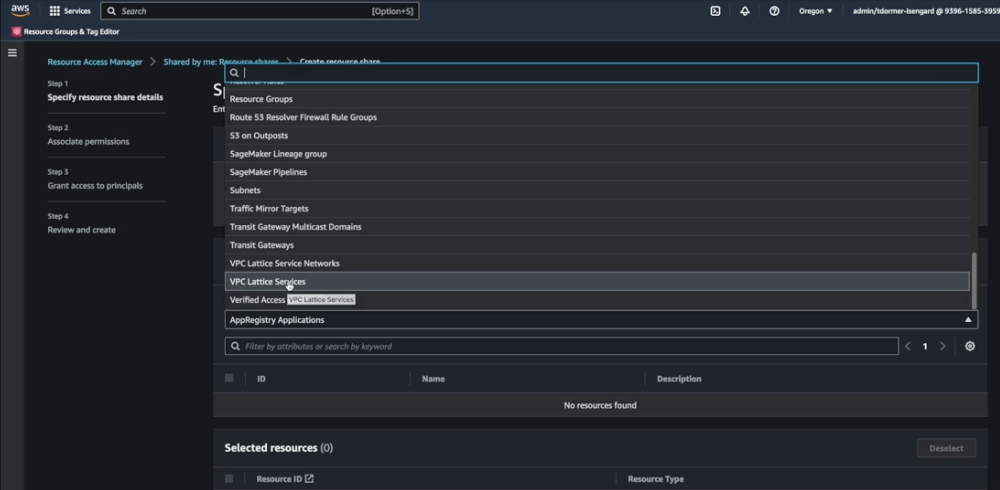
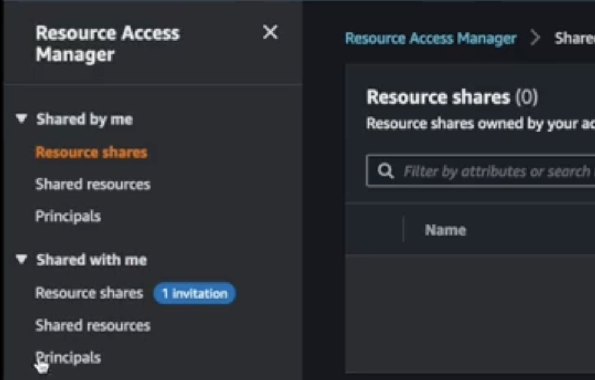
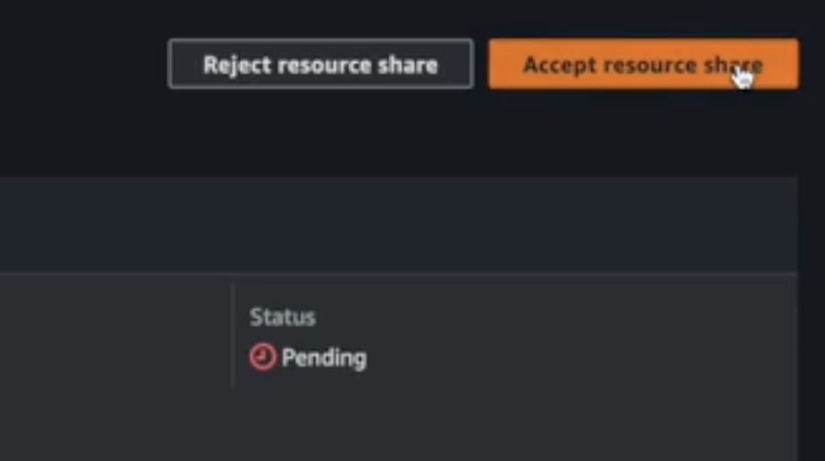

# Share Kubernetes Gateway (VPC Lattice Service Network) between different AWS accounts

[AWS Resource Access Manager](https://aws.amazon.com/ram/) (AWS RAM) helps you share your resources across AWS Accounts, within your [AWS Organization](https://aws.amazon.com/organizations/) or Organizational Units (OUs).  RAM supports 2 types of VPC Lattice resource sharing: VPC Lattice Services and Service Networks.

### Walkthrough

Let's build an example where **<span style="color:green">Account A (*sharer account*)</span>**  shares its Service Network with **<span style="color:red">Account B (*sharee account*)</span>**, and **<span style="color:red">Account B</span>** can access all Kubernetes `services` (VPC Lattice Target Groups) and Kubernetes `HTTPRoutes`(VPC Lattice Services) within this sharer account's service network.

**Create a VPC Lattice Resources**

In **<span style="color:green">Account A</span>**, set up a cluster with the Controller and an example application installed. You can follow the [Getting Started guide](../guides/getstarted.md)  up to the ["Single Cluster"](../guides/getstarted.md#single-cluster) section.


**Share the VPC Lattice Service Network**

Now that we have a VPC Lattice Service Network and Service in **<span style="color:green">Account A </span>**, share this Service Network to **<span style="color:red">Account B</span>**.

1. Open the AWS RAM console in **<span style="color:green">Account A</span>**, create a `VPC Lattice Service Network` type resource sharing, and share the `my-hotel` Service Network.


<figure markdown="span">
  { width="600" }
</figure>

<figure markdown="span">
  { width="600" }
  <figcaption>Create a VPC Lattice Service Network resource sharing.</figcaption>
</figure>


1. Open the **<span style="color:red">Account B</span>**'s AWS RAM console and accept **<span style="color:green">Account A</span>**'s Service Network sharing invitation in the *"Shared with me"* section. 

    {: style="height:220px"}
    {: style="height:220px"}


1. Change your AWS profile to **<span style="color:green">Account A</span>**. You can verify that `my-hotel` Service Network resource is available in **<span style="color:red">Account B</span>**:

    ```bash
    SERVICE_NETWORK_ID=$(aws vpc-lattice list-service-networks --query "items[?name=="\'my-hotel\'"].id" | jq -r '.[]')
    echo $SERVICE_NETWORK_ID
    ```

1. Now choose an Amazon VPC in **<span style="color:red">Account B</span>**, and attach it to the `my-hotel` Service Network.

    ```sh
    VPC_ID=<your_vpc_id>
    aws vpc-lattice create-service-network-vpc-association --service-network-identifier $SERVICE_NETWORK_ID --vpc-identifier $VPC_ID
    ```

    !!!Warning
        VPC Lattice is a regional service, therefore the VPC **must** be in the same AWS Region of the Service Network you created in **<span style="color:green">Account A</span>**. 

**Test cross-account connectivity**

You can verify that the `parking` and `review` microservices - in **<span style="color:green">Account A</span>** - can be consumed from resources in  the assocuated VPC in **<span style="color:red">Account B</span>**. 

1. To simplify, let's [create and connect to a Cloud9 environment](https://docs.aws.amazon.com/cloud9/latest/user-guide/tutorial-create-environment.html) in the VPC you previously attached to the `my-hotel` Service Network. 

2. Install `curl` in the instance and curl `parking` and `rates` microservices:

    ```sh
    sudo apt-get install curl
    curl $ratesFQDN/parking $ratesFQDN/review
    ```

**Cleanup**

To avoid additional charges, remove the demo infrastructure from your AWS Accounts.

1. Delete the Service Network Association in **<span style="color:red">Account B</span>**:
    ```bash
    VPC_ID=<your_vpc_id>
    SERVICE_NETWORK_ASSOCIATION_IDENTIFIER=$(aws vpc-lattice list-service-network-vpc-associations --vpc-id $VPC_ID --query "items[?serviceNetworkName=="\'my-hotel\'"].id" | jq -r '.[]')
    aws vpc-lattice delete-service-network-vpc-association  --service-network-vpc-association-identifier $SERVICE_NETWORK_ASSOCIATION_IDENTIFIER
    ```

    Ensure the Service Network Association is deleted:
    ```bash 
    aws vpc-lattice list-service-network-vpc-associations --vpc-id $VPC_ID
    ```

1. [Delete the Service Network RAM share resource](https://docs.aws.amazon.com/ram/latest/userguide/working-with-sharing-delete.html) in AWS RAM Console.

1. Follow the [cleanup section of the getting Started guide](../guides/getstarted.md/#cleanup) to delete Cluster and Service Network Resources in **<span style="color:green">Account A</span>**.

1. [Delete the Cloud9 Environment](https://docs.aws.amazon.com/cloud9/latest/user-guide/tutorial-clean-up.html) in **<span style="color:red">Account B</span>**. 